# Message Forest Architecture

## Overview

The Message Forest is a tree-based data structure that enables **context compression** while preserving full message history. Instead of a flat list of messages, we organize them into a forest where **compactification nodes** can group multiple messages under a summary.

```
┌─────────────────────────────────────────────────────────────────┐
│                        Message Forest                           │
├─────────────────────────────────────────────────────────────────┤
│                                                                 │
│  [User: "Find files about auth"]                                │
│      │                                                          │
│      └── [Assistant: "I'll search for auth files"]              │
│              │                                                  │
│              └── ┌─────────────────────────────────────┐        │
│                  │  📦 ToolLoopSummary                 │        │
│                  │  "Searched project, found 3 auth    │        │
│                  │   files in Sources/Auth/"           │        │
│                  │                                     │        │
│                  │  Children (collapsed):              │        │
│                  │  ├── find_file → 12 matches         │        │
│                  │  ├── read_file → AuthMiddleware     │        │
│                  │  └── read_file → AuthService        │        │
│                  └─────────────────────────────────────┘        │
│                          │                                      │
│                          └── [Assistant: "Found 3 files..."]    │
│                                  │                              │
│                                  └── [User: "Thanks!"]          │
│                                                                 │
└─────────────────────────────────────────────────────────────────┘
```

---

## Core Concepts

### MessageNode

A node in the forest that wraps either a **message** or a **compactification node**.

```swift
public enum NodeContent: Sendable, Equatable {
    case message(Message)
    case compaction(CompactificationNode)
}

public struct MessageNode: Identifiable, Sendable {
    public let id: UUID
    public var content: NodeContent
    public var children: [MessageNode]
}
```

### CompactificationNode

A virtual node that summarizes its children. Stored in DB, referenced by parent `MessageNode`.

```swift
public struct CompactificationNode: Identifiable, Codable, Sendable {
    public let id: UUID
    public var type: CompactificationType
    public var summary: String           // Context-level description
    public var displayHint: String       // UI-level description
    public var childIds: [UUID]          // IDs of grouped messages
    public var metadata: [String: String]
    public var createdAt: Date
}

public enum CompactificationType: String, Codable {
    case toolExecution  // Single tool call + response
    case toolLoop       // Multiple consecutive executions
    case broad          // Meta-summary when tokens exceeded
}
```

---

## Compactification Types

### 1. ToolExecutionSummary

Groups a **single tool call** with its **response**.

| Property | Value |
|----------|-------|
| **Trigger** | Every tool execution |
| **Generation** | Synchronous, from tool definition |
| **Content** | `[tool_name(args)] → result_summary` |

**How it works**: Tools define a `summarize()` method that returns a compact description:

```swift
protocol Tool {
    // Existing
    func execute(parameters: [String: Any]) async throws -> ToolResult
    
    // New
    func summarize(parameters: [String: Any], result: ToolResult) -> String
}
```

Example implementation:
```swift
// ReadFileTool
func summarize(parameters: [String: Any], result: ToolResult) -> String {
    let path = parameters["path"] as? String ?? "unknown"
    let lines = result.output.components(separatedBy: "\n").count
    return "[read_file(\(path))] → \(lines) lines"
}
```

---

### 2. ToolLoopSummary

A **grouping node** for UI organization — groups consecutive `ToolExecutionSummary` nodes.

| Property | Value |
|----------|-------|
| **Trigger** | Assistant responds after ≥2 tool calls |
| **Generation** | None (pure grouping) |
| **For Context** | Outputs child `ToolExecutionSummary` summaries concatenated |
| **For Display** | Collapsible group showing child summaries |

**Context output** (concatenates children):
```
[find_file(*.swift)] → 12 matches
[read_file(AuthMiddleware.swift)] → 45 lines  
[read_file(AuthService.swift)] → 120 lines
```

**Display output** (collapsible):
```
┌─────────────────────────────────────┐
│ 📦 Tool Loop (3 tools)              │
│ ├── find_file → 12 matches          │
│ ├── read_file → AuthMiddleware      │
│ └── read_file → AuthService         │
│                    [▼ Collapse]     │
└─────────────────────────────────────┘
```

---

### 3. BroadSummary

Collapses older context when **token threshold exceeded** (6000 tokens).

| Property | Value |
|----------|-------|
| **Trigger** | Context tokens > 6000 |
| **Generation** | Async, but **blocking if at limit** |
| **Content** | High-level conversation summary |

**Behavior**:
- If tokens > 6000, trigger async summarization
- If tokens > 8000 (hard limit), **wait for summary** before proceeding

---

## Verbosity Levels

Each node provides **three representations**:

| Level | Use Case | Content |
|-------|----------|---------|
| **Context** | Sent to LLM | Minimal (summary only) |
| **Display** | UI chat view | Moderate (summary + indicator) |
| **Full** | Debug/History | Complete (all children expanded) |

```swift
extension MessageNode {
    /// Minimal - for LLM context
    func flattenedForContext() -> [Message]
    
    /// Moderate - for UI display  
    func flattenedForDisplay() -> [(message: Message, isCompacted: Bool)]
    
    /// Full - for history/debug
    func flattenedForHistory() -> [Message]
}
```

**Display example**:
```
┌────────────────────────────────────────────┐
│ 📦 Tool Loop (3 tools)                     │
│ Searched auth files, read middleware code  │
│                                            │
│ [▶ Expand to see details]                  │
└────────────────────────────────────────────┘
```

---

## Data Flow

```mermaid
sequenceDiagram
    participant User
    participant ChatLoop
    participant ToolExecutor
    participant Persistence
    participant UtilityModel
    
    User->>ChatLoop: Send message
    ChatLoop->>ToolExecutor: Execute tool calls
    ToolExecutor->>ToolExecutor: Create ToolExecutionSummary (from tool.summarize())
    ToolExecutor-->>Persistence: Save execution nodes
    
    Note over ChatLoop: After ≥2 tools
    ChatLoop->>ChatLoop: Create ToolLoopSummary (grouping node)
    ChatLoop-->>Persistence: Save loop node
    
    ChatLoop->>User: Return response
    
    Note over ChatLoop: If tokens > 6000
    ChatLoop->>UtilityModel: Generate BroadSummary (async)
    UtilityModel-->>Persistence: Save broad node
```



---

## Database Schema

```sql
CREATE TABLE compactificationNode (
    id BLOB PRIMARY KEY,
    sessionId BLOB NOT NULL REFERENCES conversationSession(id),
    type TEXT NOT NULL,           -- 'toolExecution', 'toolLoop', 'broad'
    summary TEXT NOT NULL,
    displayHint TEXT,
    childIds TEXT NOT NULL,       -- JSON array of UUIDs
    metadata TEXT,                -- JSON object
    createdAt DATETIME NOT NULL
);
```

---

## Integration Points

| Component | Integration |
|-----------|-------------|
| `ToolExecutor` | Creates `ToolExecutionSummary` after each execution |
| `SessionManager` | Tracks pending executions, triggers loop summaries |
| `PromptBuilder` | Uses `flattenedForContext()` for LLM messages |
| `ChatController` | Checks token threshold, triggers broad summary |
| `PersistenceService` | Saves/loads compactification nodes |
