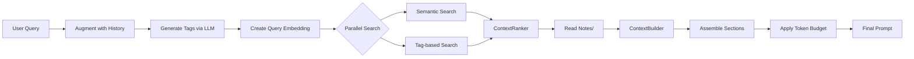

# System Architecture

Monad follows a modular architecture designed to separate core logic, server infrastructure, and client interfaces. The project is organized into distinct Swift targets, each with a specific responsibility.

## Module Overview

### MonadPrompt: Prompt Construction DSL
A standalone, dependency-free library for constructing LLM prompts with built-in token management.

**Responsibilities:**
- `@ContextBuilder` result builder for composing prompt sections
- Token budgeting with priority-based allocation
- Compression strategies (`keep`, `truncate`, `summarize`, `drop`)
- Context section protocol and implementations

**Dependencies:** None (completely standalone)

**Key Types:**
- `ContextBuilder` — Result builder for prompt composition
- `ContextSection` — Protocol for prompt sections
- `CompressionStrategy` — Enum for handling token budget overflow

---

### MonadCore: The Engine Room
Contains the foundational library for all domain logic, data models, and business rules.

**Responsibilities:**
- **Data Models**: Organized into focused subdirectories (see Models section below)
- **Configuration**: `LLMConfiguration` supporting OpenAI, OpenRouter, Ollama, OpenAI-compatible providers
- **Persistence**: GRDB-based storage via `PersistenceService`
- **Context Engine**: RAG logic via `ContextManager` (semantic search + tag boosting + re-ranking)
- **Session Management**: Lifecycle of `Timeline` sessions via `TimelineManager`
- **Tool Logic**: Workspace-aware tool resolution via `ToolRouter` and `ToolExecutor`
- **LLM Integration**: Multi-provider LLM client via `LLMService`
- **Agent Execution**: `AgentExecutor` for autonomous agent loops
- **Streaming**: `StreamingParser` for parsing LLM responses with CoT extraction

**Dependencies:**
- MonadPrompt (for prompt construction)
- OpenAI (for OpenAI API client)
- Logging (for structured logging)
- USearch (for vector embeddings)
- swift-dependencies (for DI)

**Key Services:**
- `ChatEngine` — Unified engine for chat and autonomous agents (uses Pipeline pattern)
- `TimelineManager` — Actor managing timeline lifecycle and components
- `AgentInstanceManager` — Actor managing agent instance creation, attachment, and deletion
- `ContextManager` — Actor for RAG and context gathering (uses Pipeline pattern)
- `Pipeline` — Generic asynchronous pipeline utility in `MonadCore/Utilities/Pipeline.swift`
- `ToolRouter` — Actor routing tool execution to appropriate handler
- `LLMService` — Multi-provider LLM client with streaming
- `WorkspaceManager` — Actor managing workspace lifecycle
- `AgentTemplateExecutor` — Service executing autonomous AgentTemplate tasks
- `VectorStore` — Vector search for semantic memory retrieval

**Models Organized Into:**
```
Sources/MonadCore/Models/
├── Context/       ActiveMemory, ContextFile, DebugSnapshot
├── Database/      ConversationMessage, DatabaseBackup, Memory, SemanticSearchResult, Timeline
├── Tools/         ToolReference+OpenAI.swift
│   └── ToolContext/  ContextTool, ToolContext, ToolTimelineContext
└── Workspace/     WorkspaceAttachment, WorkspaceLock, WorkspaceProtocol,
                   WorkspaceReference, WorkspaceTool, WorkspaceToolDefinition

Sources/MonadShared/SharedTypes/
├── AgentInstance.swift, AgentTemplate.swift
├── ChatEvent.swift, Message.swift, ToolCall.swift
├── LLMConfiguration.swift, ProviderConfiguration.swift, ToolCallFormat.swift
├── WorkspaceReference.swift, WorkspaceURI.swift
└── ToolOutputSubmission.swift, ToolResult.swift

Sources/MonadShared/Tools/
└── Filesystem/    7 filesystem tools (cd, find, inspect, ls, cat, grep, search)

Sources/MonadCore/Services/Workspace/
└── WorkspaceManager.swift — Actor cache for hydrated WorkspaceProtocol instances
```

**Key Model Notes:**
- **`Timeline`** (formerly `ConversationSession`) — Persistent conversation record. Fields: `attachedAgentInstanceId`, `isPrivate`.
- **`AgentInstance`** — Runtime agent entity in `MonadShared`. Has its own private workspace and private timeline. Created from an `AgentTemplate`.
- **`AgentTemplate`** — Static agent template in `MonadShared`. Defines `systemPrompt`, `personaPrompt`, `guardrailsPrompt`, and `workspaceFilesSeed`.
- **`LLMConfiguration`** — Multi-provider config (replaces old monolithic `Configuration`)
- **`Message`** — Includes optional `think` field for Chain of Thought reasoning
- **`ToolReference`** — Enum: `.known(id)` or `.custom(definition)`
- **`WorkspaceReference`** — Metadata about a workspace (ID, URI, host type, tools, trust level)
- **`WorkspaceManager`** — Actor that caches hydrated workspaces; used by `FilesAPIController`

---

### MonadShared: Common Types
Lightweight, dependency-free models used by all modules to prevent circular dependencies.

**Responsibilities:**
- Shared types between client and server
- API contract types split into category-specific files

**Dependencies:** None (standalone — no MonadCore dependency)

**Key Types:**
API contract types in `Sources/MonadShared/Models/`:
- `ChatAPI.swift` — ChatRequest, ChatResponse
- `ClientAPI.swift` — Client connection types
- `MemoryAPI.swift` — Memory CRUD types
- `SessionAPI.swift` — Timeline management types (responses, requests)
- `WorkspaceAPI.swift` — Workspace types
- `ToolAPI.swift` — Tool-related types
- `CommonAPI.swift` — Shared/common types
- `SystemStatus.swift` — Health/status types

Shared runtime types in `Sources/MonadShared/SharedTypes/`:
- `AgentInstance.swift` — Live agent entity
- `AgentTemplate.swift` — Agent template
- `LLMConfiguration.swift`, `ProviderConfiguration.swift` — LLM config
- `WorkspaceReference.swift`, `WorkspaceURI.swift` — Workspace metadata
- `ChatEvent.swift`, `Message.swift`, `ToolCall.swift` — Streaming types

---

### MonadServer: The Gateway
The backend server hosting the agent and exposing the brain to clients.

**Responsibilities:**
- **API Layer**: Hummingbird REST endpoints with SSE streaming
- **Persistence**: GRDB/SQLite implementation via `PersistenceService`
- **WebSocket**: Real-time client connections via `WebSocketConnectionManager`
- **Discovery**: Bonjour/mDNS advertisement for client auto-discovery
- **Maintenance**: `OrphanCleanupService` for database cleanup
- **Service Lifecycle**: Graceful shutdown via `ServiceGroup`

**Dependencies:**
- MonadCore (for business logic)
- MonadShared (for API types)
- MonadPrompt (for prompt construction)
- MonadClient (for client discovery)
- GRDB (for SQLite persistence)
- Hummingbird (for HTTP server)
- HummingbirdWebSocket (for WebSocket support)
- ServiceLifecycle (for graceful shutdown)
- ArgumentParser (for CLI arguments)
- Logging (for structured logging)

**Controllers** (in `Sources/MonadServer/Controllers/`):
- `ChatAPIController` — Chat streaming endpoints (`POST /sessions/:id/chat/stream`)
- `TimelineAPIController` — Timeline CRUD (`/sessions`)
- `MemoryAPIController` — Memory operations (`/memories`)
- `WorkspaceAPIController` — Workspace management (`/workspaces`)
- `ClientAPIController` — Client registration (`/clients`)
- `ConfigurationAPIController` — Configuration management (`/config`)
- `ToolAPIController` — Tool listing (`/tools`)
- `AgentInstanceAPIController` — Agent instance CRUD and attachment (`/agents`)
- `AgentTemplateAPIController` — AgentTemplate management (`/agentTemplates`)
- `StatusAPIController` — Health/status endpoints
- `FilesAPIController` — File operations (`/workspaces/:id/files`)
- `PruneAPIController` — Data cleanup (`/prune`)
- `WebSocketAPIController` — WebSocket connections

**Services** (in `Sources/MonadServer/Services/`):
- `PersistenceService` — GRDB-based storage (implements all persistence protocols)
- `BonjourAdvertiser` — mDNS/Bonjour service discovery
- `WebSocketConnectionManager` — Client connection tracking
- `OrphanCleanupService` — Maintenance tasks
- `ServerLLMService` — Server-specific LLM service wrapper
- `ConfigurationStorage` — Configuration persistence
- `ChatEvent.swift` — Unified streaming event model

**Database Schema:**
- Migrations managed via GRDB
- Tables: `timelines`, `messages`, `memories`, `jobs`, `agentInstances`, `agentTemplates`, `workspaces`, `clients`, etc.
- Schema versioning for backward compatibility

---

### MonadClient: Client Library
Swift library for cross-platform integration, abstracting server communication.

**Responsibilities:**
- HTTP client for MonadServer REST API
- Bonjour/mDNS client-side discovery
- RPC support for client-hosted workspaces
- Secure elevation of workspace trust levels

**Dependencies:**
- MonadCore (for core types)
- MonadShared (for API types)
- Logging (for structured logging)

**Key Components:**
- HTTP client wrapping URLSession
- Bonjour browser for server discovery
- Client-side workspace implementation
- User-approval flow for write access

---

### MonadCLI: Development Interface
A powerful REPL and command-line tool.

**Responsibilities:**
- Interactive REPL with rich terminal interface
- Slash commands for chat, sessions, memory, workspaces, jobs, files, system
- One-off query mode (`monad q <query>`)
- Command generation mode (`monad cmd <description>`)
- Status checking (`monad status`)

**Dependencies:**
- MonadClient (for server communication)
- ArgumentParser (for CLI parsing)

**Slash Command Categories:**
- **Chat**: `/help`, `/quit`, `/new`, `/clear`
- **Session**: `/session` (info, list, switch, delete, rename, log)
- **Memory**: `/memory` (all, search, view)
- **Workspace**: `/workspace` (list, attach, detach)
- **Jobs**: `/job` (list, add, delete)
- **Files**: `/ls`, `/cat`, `/rm`, `/write`, `/edit`
- **System**: `/debug`, `/config`, `/status`, `/tool`, `/client`

---

## Dependency Hierarchy

```
MonadPrompt (no dependencies)
    ↓
MonadCore → [MonadPrompt, OpenAI, Logging, USearch, Dependencies]
    ↓
MonadShared → [MonadCore]
    ↓
MonadClient → [MonadCore, MonadShared, Logging]
    ↓ ↓
    ↓ MonadCLI → [MonadClient, ArgumentParser]
    ↓
MonadServer → [MonadCore, MonadShared, MonadPrompt, MonadClient,
               GRDB, Hummingbird, HummingbirdWebSocket, ServiceLifecycle,
               ArgumentParser, Logging]
```

**Key Design Principle:** No circular dependencies. Clean unidirectional flow.

---

## Pipeline Pattern

MonadCore uses a generic asynchronous pipeline utility for orchestrating complex multi-stage processes. This decouples logic into discrete, testable stages.

**Location:** `Sources/MonadCore/Utilities/Pipeline.swift`

**Key Components:**
- `Pipeline<Context, Event>` — The main coordinator class.
- `PipelineStage<Context, Event>` — Protocol defining a single stage.

**Usage in Codebase:**
- **ChatEngine**: `processTurn` is decomposed into stages: `PromptBuildingStage`, `LLMStreamingStage`, `ToolCallExtractionStage`, `MessagePersistenceStage`.
- **ContextManager**: The context gathering flow is implemented as a pipeline.

---

## Data Flow

### Chat Request Flow

1. **Input**: User sends a message via `MonadCLI` → `MonadClient` → `MonadServer`

2. **Routing**: `MonadServer` routes the request to `ChatAPIController` which delegates to `ChatEngine`

3. **Context Assembly**:
   - `ChatEngine` uses `ContextManager.gatherContext()` to collect:
     - Context Notes from `Notes/` directory (high priority)
     - Semantic memories (vector search + tag boosting + re-ranking)
     - Recent chat history from `Timeline`
   - Uses `@ContextBuilder` (MonadPrompt) to construct the LLM prompt with token budgeting
   - Includes tool definitions formatted with provenance labels

4. **LLM Invocation**:
   - `ChatEngine` calls `LLMService.chatStream()`
   - `LLMService` routes to appropriate provider (OpenAI/OpenRouter/Ollama)
   - Returns `AsyncThrowingStream<ChatStreamResult, Error>`

5. **Streaming Response**:
   - `StreamingParser` processes delta chunks
   - Extracts Chain of Thought from `<think>...</think>` tags
   - Separates reasoning (`thought`) from user-facing content (`delta`)
   - Detects tool calls in streaming response

6. **Tool Execution** (if requested):
   - `ChatEngine` extracts tool calls from LLM response
   - `ToolRouter` determines if tool is local (server) or remote (client)
   - **Local execution**: Execute directly on server
   - **Remote execution**: Throw `ToolError.clientExecutionRequired`, delegate to client
   - Tool results fed back to LLM as new `Message` with role `.tool`
   - LLM continues generation with tool results

7. **Streaming to Client**:
   - `ChatEngine` yields `ChatEvent` objects
   - SSE stream sends events to client (Codable JSON):
     - `meta.generationContext` — Initial metadata
     - `delta.thinking` / `delta.generation` — LLM output
     - `delta.toolCall` — Tool requests
     - `delta.toolExecution` — Tool status (attempting/success/failed)
     - `completion.generationCompleted` — Final message + metadata
     - `completion.streamCompleted` — End of stream

8. **Persistence**:
   - Messages saved to database via `PersistenceService`
   - Timeline `updatedAt` timestamp updated
   - Debug snapshots stored for `/debug` command

---

## Tool Execution Flow

```mermaid
flowchart TD
    LLM[LLM Requests Tool] --> Router[ToolRouter]
    Router --> Resolve{Resolve Workspace}

    Resolve --> Primary[Primary Workspace?]
    Resolve --> Attached[Attached Workspace?]
    Resolve --> NotFound[Tool Not Found]

    Primary --> Local[Local Execution]
    Attached --> CheckHost{Host Type?}

    CheckHost --> Server[Server/ServerSession]
    CheckHost --> Client[Client]

    Server --> Local
    Client --> Remote[Throw clientExecutionRequired]

    Local --> Execute[ToolExecutor.execute()]
    Remote --> Delegate[Delegate to Client]

    Execute --> Result[ToolResult]
    Delegate --> Result

    Result --> FeedBack[Feed back to LLM]
    NotFound --> Error[ToolError]
```

**Key Points:**
- Tool identity tracked via `ToolReference`
- Provenance labels help LLM understand context: `[System]`, `[Workspace: Name]`, `[Session]`
- Path resolution: workspace-relative paths, jail to workspace root via `PathSanitizer`
- Client tools require RPC delegation (handled by client)

---

## Context Assembly Pipeline



**Sections (by priority):**
1. **System Instructions** (priority: 100, strategy: keep)
2. **Agent Context** (priority: 95, strategy: keep) — agent name, description, current timeline
3. **Context Notes** (priority: 90, strategy: truncate)
4. **Memories** (priority: 85, strategy: summarize)
5. **Tools** (priority: 80, strategy: keep)
6. **Workspaces** (priority: 75, strategy: keep)
7. **Timeline Context** (priority: 72, strategy: keep) — current timeline ID and title
8. **Chat History** (priority: 70, strategy: truncate from start)
9. **User Query** (priority: 10, strategy: keep)

**Token Budgeting:**
- Higher priority sections allocated tokens first
- Strategies applied when budget exceeded:
  - `keep` — Keep as-is, drop if no budget
  - `truncate` — Clip from start or end
  - `summarize` — Use smaller LLM to produce gist
  - `drop` — Drop section entirely

---

## Streaming Protocol (SSE)

The `/sessions/{id}/chat` endpoint emits Server-Sent Events with the following types:

| Event Type | Description | Payload Fields |
|:-----------|:------------|:---------------|
| `generationContext` | Initial context information | `timelineId`, `agentId`, `primaryWorkspace`, `attachedWorkspaces` |
| `thought` | Chain of Thought reasoning (from `<think>` tags) | `thought` (string) |
| `delta` | User-facing text fragments | `content` (string) |
| `toolCall` | LLM requesting a tool | `toolCallId`, `name`, `arguments` (streaming) |
| `toolExecution` | Tool execution status update | `toolCallId`, `name`, `status` (attempting/success/failed), `result` |
| `generationCompleted` | Turn complete | `message` (full Message object), `responseMetadata` (token counts) |
| `streamCompleted` | End of stream | (empty) |
| `error` | Error encountered | `error` (string) |

**Client Handling:**
- Accumulate `delta` events for user-facing content
- Display `thought` events separately (or hide)
- Show `toolExecution` status for transparency
- Parse final `message` from `generationCompleted` for storage

---

## Workspace Model

### Workspace Types

| Host Type | Description | Location | Tools |
|:----------|:------------|:---------|:------|
| `serverTimeline` | Private session sandbox | Server disk | Filesystem, session tools |
| `server` | Shared project directory | Server disk | Filesystem, workspace tools |
| `client` | Remote client environment | Client machine | Client-provided tools (RPC) |

### Trust Levels

| Trust Level | Description | Behavior |
|:------------|:------------|:---------|
| `full` | Full access | Operations execute immediately |
| `restricted` | Limited access | Operations require approval (future) |

### Workspace Lifecycle

1. **Creation**: Primary workspace created automatically with session
2. **Auto-Attachment**: Current directory attached as `.readOnly` on startup
3. **Manual Attachment**: Shared workspaces attached via `/workspace attach`
4. **Discovery**: `WorkspaceFactory` creates appropriate `WorkspaceProtocol` implementation
5. **Tool Registration**: `TimelineToolManager` aggregates tools from all workspaces
6. **Execution**: `ToolRouter` routes tool calls to correct workspace
7. **Elevation**: Assistant requests write access via `request_write_access` tool
8. **Health Checking**: `WorkspaceManager` monitors workspace availability
9. **Detachment**: Workspaces can be detached, removing their tools from session

---

## Concurrency Model

### Actors
Heavy use of actors for thread-safe state management:
- `TimelineManager` — Timeline lifecycle and component caching
- `AgentInstanceManager` — Agent instance creation, attachment, and deletion
- `ContextManager` — RAG and context gathering
- `ToolRouter` — Tool routing and execution
- `WorkspaceManager` — Workspace lifecycle

**Pattern:**
```swift
public actor TimelineManager {
    internal var timelines: [UUID: Timeline] = [:]

    public func createTimeline(title: String) async throws -> Timeline {
        // All mutations serialized by actor
    }
}
```

### Streaming
Extensive use of `AsyncThrowingStream` for progress and streaming:
- `ChatEngine.chatStream()` → `AsyncThrowingStream<ChatEvent, Error>`
- `ContextManager.gatherContext()` → `AsyncThrowingStream<ContextGatheringEvent, Error>`
- `LLMService.chatStream()` → `AsyncThrowingStream<ChatStreamResult, Error>`

**Pattern:**
```swift
AsyncThrowingStream<Event, Error> { continuation in
    let task = Task {
        // Work here
        continuation.yield(.progress(...))
        continuation.finish()
    }
    continuation.onTermination = { @Sendable _ in
        task.cancel()
    }
}
```

### Graceful Shutdown
Services use `cancelWhenGracefulShutdown` from `ServiceLifecycle`:

**Reference Implementation:** `BonjourAdvertiser`

**Critical:** Do NOT rely on `Task.isCancelled` alone — it's only set after all services return from `run()`.

---

## Dependency Injection

Uses Point-Free's `swift-dependencies` for DI:

**Dependency Keys** (in `Sources/MonadCore/Dependencies/`):
- `LLMDependencies.swift` — LLMService, EmbeddingService
- `OrchestrationDependencies.swift` — TimelineManager, ChatEngine, AgentTemplateExecutor, etc.
- `StorageDependencies.swift` — PersistenceService, VectorStore

**Usage:**
```swift
@Dependency(\.timelineManager) private var timelineManager
```

**Configuration:**
```swift
withDependencies {
    $0.sessionManager = myTimelineManager
} operation: {
    // Use dependencies
}
```

---

## Summary

Monad's architecture demonstrates:

- **Clean separation of concerns** with six focused modules
- **No circular dependencies** via careful layering
- **Modern Swift concurrency** (actors, async/await, structured concurrency)
- **Robust streaming** (AsyncThrowingStream throughout)
- **Type safety** (Swift 6, Sendable, strong typing)
- **Dependency injection** (swift-dependencies)
- **Multi-provider LLM support** (OpenAI, OpenRouter, Ollama, compatible)
- **Workspace abstraction** (server/client split with secure path jailing)
- **Tool protocol** (extensible, well-designed with provenance tracking)
- **RAG integration** (semantic + tag search with re-ranking)
- **Comprehensive testing** (mock services, fixtures, HummingbirdTesting)

The system is production-ready, well-tested, and follows Swift best practices throughout.
