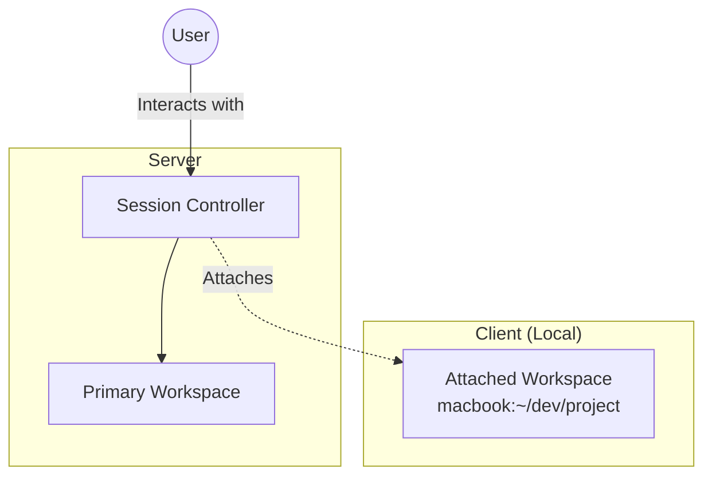
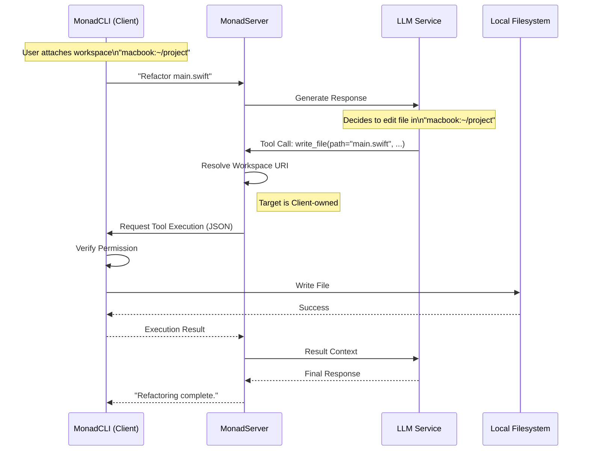
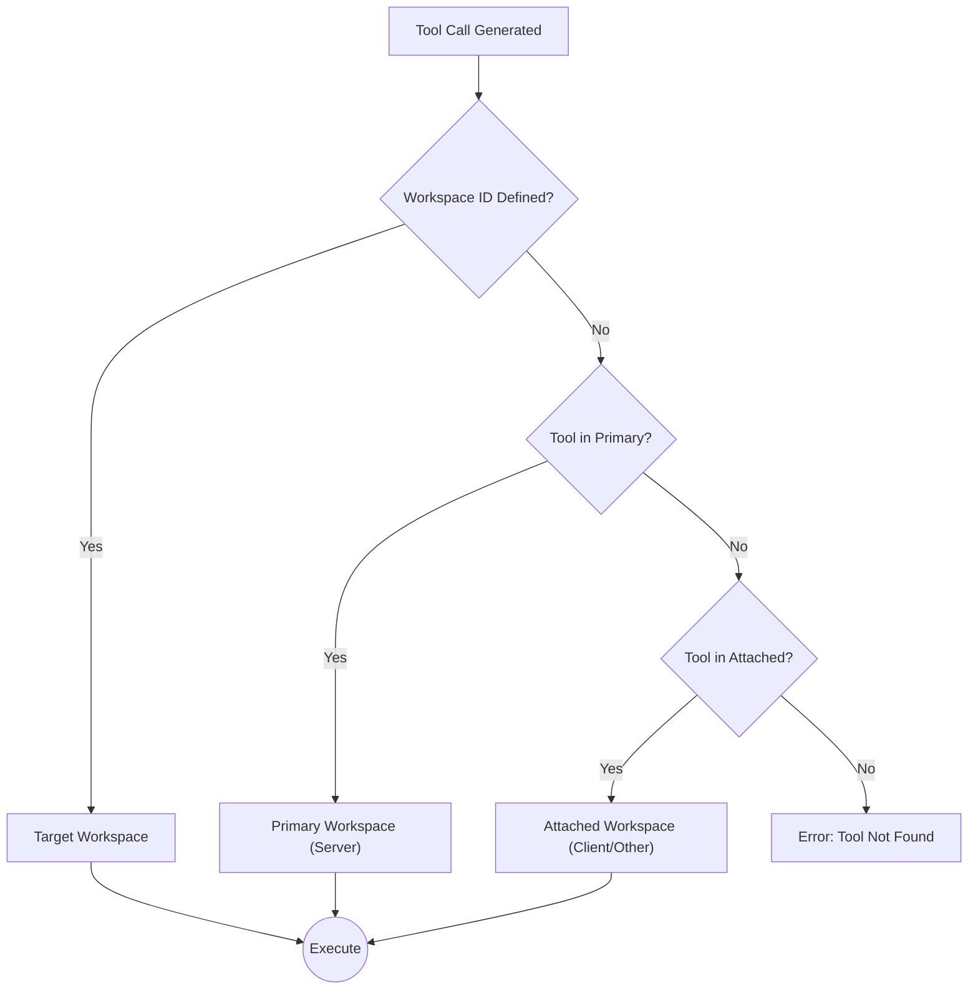

# Workspaces & Tool Execution

## Motivation
Current LLM tool implementations lack persistent state and context awareness, treating file operations and command execution as isolated, ephemeral events. The Workspaces feature addresses this by establishing secure, addressable execution boundaries. This allows Monad to maintain persistent file storage on the server, safely access a user's local development environment, and isolate sensitive operations in sandboxed containers, all while using a unified addressing scheme.

## Key Concepts

### 1. The Universal Address (URI)
We use an SCP-like URI scheme to uniquely identify workspaces across the distributed system.

| URI Example | Type | Description |
| :--- | :--- | :--- |
| `monad-server:/sessions/a1b2` | **Server** | A persistent workspace for a specific conversation. |
| `macbook-pro:~/dev/monad` | **Client** | A developer's local project folder. |
| `git:github.com/monad/core` | **Virtual** | A transient workspace cloned from a repository. |

### 2. Session Architecture
Every conversation session is assigned a **Primary Workspace** on the server for long-term memory and state. Users can **Attach** additional workspaces (like local folders) to bring them into the context.

## Workflows

### 1. Remote Tool Execution (Client-Side)
This workflow demonstrates how the Server orchestrates tools running on the Client's machine (e.g., editing a local file).

### 2. Intelligent Tool Resolution Strategy
When the LLM requests a tool without a specific target, the system routes the request based on priority.

## Security & Isolation

*   **Boundaries**: Tools are strictly confined to their workspace `rootPath`. Path traversal attempts are blocked at the framework level.
*   **Trust Levels**: Workspaces are assigned levels (`Full` or `Restricted`). 
    *   **Full**: Trusted environments where tools execute without per-call interruption.
    *   **Restricted**: Local directories and untrusted environments (e.g., cloned git repos). These require explicit user approval for tool execution and operate with a limited toolset.
*   **Locks**: Workspaces are locked during generation cycles to ensure state consistency between the user and the AI.