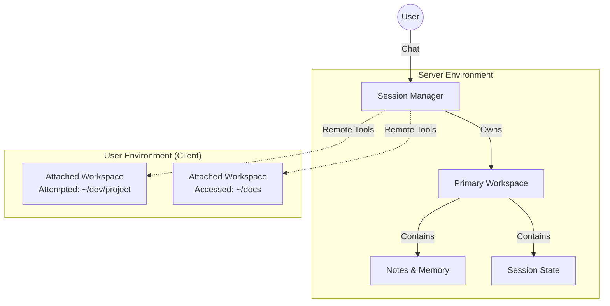
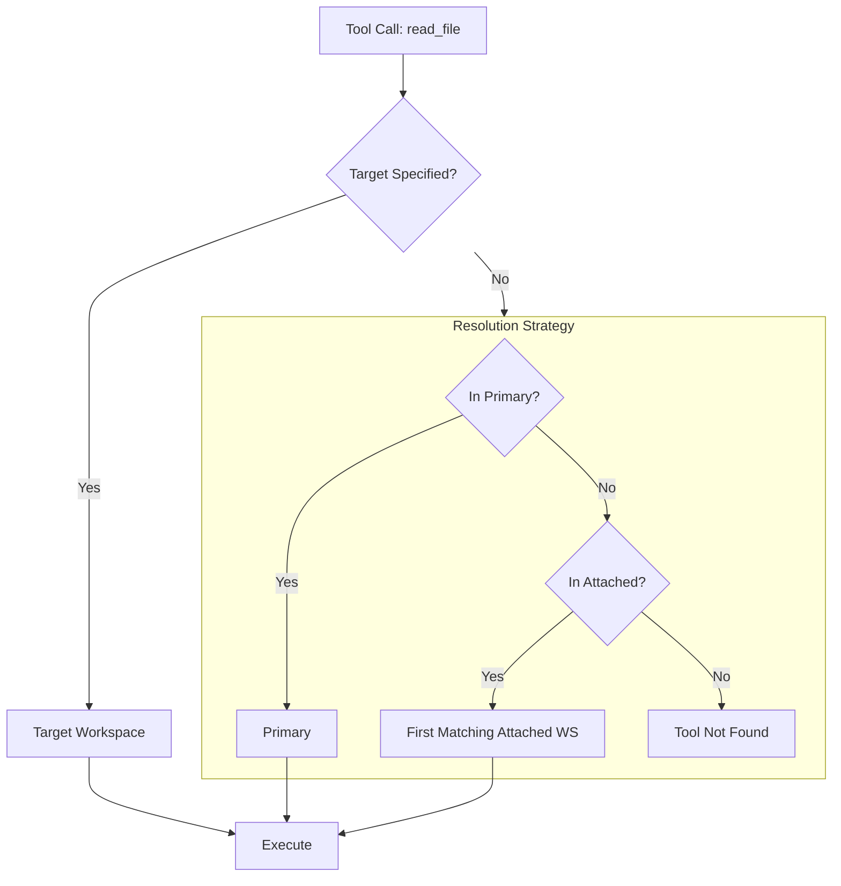

# Workspaces & Tool Execution

## Overview
Monad's architecture is built around the concept of **Workspaces**—secure, addressable execution environments where tools operate. This design unifies local execution (on the user's machine) and remote execution (on the server), providing a consistent interface for the AI to interact with files, run commands, and manage state.

## Key Concepts

### 1. The Workspace
A **Workspace** is a defined environment with a specific root path, trust level, and set of available tools. It allows the AI to "visit" different locations (e.g., a local projected folder, a server-side session folder) without carrying over accidental state or violating security boundaries.

| Feature | Description |
| :--- | :--- |
| **URI** | Unique identifier (e.g., `macbook-pro:~/dev/monad`, `server:/sessions/a1b2`). |
| **Root Path** | The filesystem directory that confines all file operations. |
| **Host Type** | `Server` (managed by MonadServer) or `Client` (managed by MonadCLI/Client). |
| **Trust Level** | `Full` (trusted, auto-execute) or `Restricted` (requires user approval). |

### 2. The Session
A **Session** (`ConversationSession`) represents a continuous thread of interaction between the User and the AI. It orchestrates context, memory, and tool execution.

*   **Primary Workspace (Server)**: Every session has a dedicated, server-side workspace. This is where the AI stores conversation notes, generated artifacts, and "long-term" thinking. It is always trusted.
*   **Attached Workspaces (Client/Remote)**: Users can "attach" their local development folders to a session. These workspaces reside on the user's machine but are accessible to the AI via the Monad Client.

## Tool Execution Flow

Tools are the hands of the AI. The `SessionToolManager` and `ToolExecutor` work together to route tool calls to the correct workspace.

### 1. Discovery
When a session starts, `SessionToolManager` aggregates all available tools from:
1.  **System Tools**: Built-in capabilities (e.g., `search_web`, `memory_recall`).
2.  **Primary Workspace**: File operations within the server session.
3.  **Attached Workspaces**: File operations and commands on the user's machine.

### 2. Routing
When the LLM requests a tool execution (e.g., `read_file(path: "main.swift")`), the system must decide *where* to run it.

### 3. Execution
*   **Server Tools**: executed directly by `MonadServer`.
*   **Client Tools**: The server sends a structural request to the connected `MonadClient`. The client prompts the user (if necessary), executes the tool locally, and returns the result to the server.

### 4. The Request/Response Loop
1.  **Assistant** generates a tool call (e.g., `list_dir`).
2.  **Server** pauses generation and routes the call.
3.  **Workspace** executes the tool (sandboxed to its root).
4.  **Result** is fed back to the Assistant as a new message.
5.  **Assistant** continues generation with the new context.

## Security & Isolation

*   **Jails**: All filesystem tools are "jailed" to the workspace's `rootPath`. Attempts to access `../` or absolute paths outside the root are blocked.
*   **Trust Levels**:
    *   **Full Trust**: Operations execute immediately. Used for the Primary Workspace and explicitly trusted local folders.
    *   **Restricted**: Operations require per-action user approval. Used for sensitive or new directories.
*   **State Isolation**: Each session has its own `ContextManager` and `ToolExecutor`, preventing cross-talk between concurrent conversations.